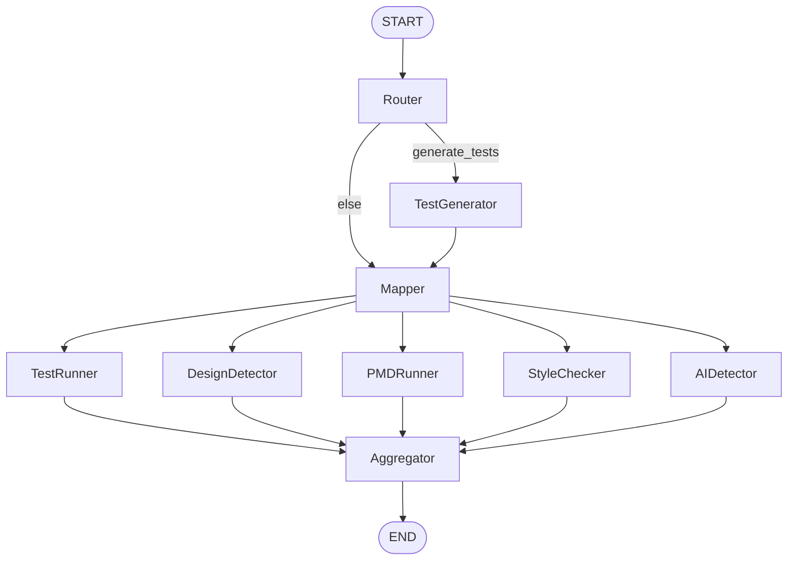

# Code Assistant

A small full-stack tool for **analyzing Java student-style submissions**. It runs several checks (tests, static analysis, style, design patterns, and an LLM-based “AI-generated” heuristic), then **aggregates everything into a score and natural-language feedback** using OpenAI. The analysis pipeline is implemented as a **[LangGraph](https://github.com/langchain-ai/langgraph)** graph; a **Flask** API exposes it, and a **React (Material UI)** UI calls that API.

> **Scope:** The pipeline targets single-file style Java with a `public class` entry point suitable for `javac` / `java`. The **Router** and several nodes rely on OpenAI; without an API key, behavior falls back or surfaces clear errors where implemented.

---

## Features

| Capability | Description |
|------------|-------------|
| **Router** | Parses free-text **intent** (or uses defaults) to choose which analyzers run and whether to **generate tests** when none are supplied. |
| **Test generator** | Optionally generates `{ input, expected_output }` cases via the LLM. |
| **Test runner** | Compiles Java in a temp dir and runs each test as stdin to `java -cp …`, comparing stdout to expected output. |
| **Design detector** | LLM-based detection of OO design patterns with confidence and adherence scores. |
| **PMD runner** | Runs [PMD](https://pmd.github.io/) with a standard set of Java rule categories; outputs violations as JSON. |
| **Style checker** | Runs [Checkstyle](https://checkstyle.org/) against a configurable rules XML (e.g. Google style). |
| **AI detector** | LLM-based guess whether code “looks” AI-generated (teaching aid only, not evidence). |
| **Aggregator** | Merges tool outputs and asks the LLM for a **0–100 score** and **feedback**. |

There is also a **`plagiarism_checker`** node (JPlag) in the codebase; it is **not** connected to the main graph in `backend/graph/builder.py`. You can extend the graph to use it if needed.

Each analysis run also writes a **graph visualization** to `backend/graph.png` (see `.gitignore`; path is fixed under the backend directory).

---

## Architecture



- **Router** may skip **TestGenerator** and go straight to **Mapper**.
- **Mapper** uses LangGraph’s map semantics so **only nodes listed in `enabled_nodes`** in the state are executed in parallel (see `per_submission_nodes` in `backend/graph/builder.py`).
- Each analyzer appends a structured fragment to `results`; **Aggregator** reduces that into `aggregated_results`, `score`, and `feedback`.

---

## Repository layout

```
code_assistant/
├── backend/
│   ├── main.py                 # Flask app: GET /, POST /analyze-code
│   ├── code_analyzer.py        # build_graph(), invoke, write graph.png
│   ├── settings.py             # Env-based config (OpenAI, PMD, Checkstyle, JPlag)
│   ├── requirements.txt
│   ├── .env.example            # Copy to .env and fill in secrets/paths
│   ├── graph/
│   │   └── builder.py          # LangGraph definition
│   ├── examples/               # Sample JSON payloads
│   │   ├── example1.json
│   │   ├── example2.json
│   │   └── example3.json
│   └── nodes/                  # One package per “node”
│       ├── router/
│       ├── test_generator/
│       ├── mapper/
│       ├── test_runner/
│       ├── design_detector/
│       ├── pmd_runner/
│       ├── style_checker/
│       ├── ai_detector/
│       ├── aggregator/
│       └── plagiarism_checker/
└── frontend/
    ├── package.json
    └── src/
        ├── App.js              # UI + fetch to backend
        └── index.js
```

---

## Prerequisites

- **Python** 3.10+ (recommended; typing uses features compatible with 3.9+ in practice—use 3.10+ for fewer surprises).
- **Node.js** 18+ and npm (for the React app).
- **JDK** with `javac` and `java` on your `PATH` (required for **Test runner**).
- **[PMD](https://pmd.github.io/pmd/pmd_userdocs_installation.html)** CLI on `PATH`, *or* set **`PMD_BIN`** to the `bin` directory inside a PMD distribution (see env table below).
- **Checkstyle** CLI installed and on your `PATH`, plus **`CHECKSTYLE_CONFIG`** pointing to a rules XML (required for **Style checker** when that node is enabled).
- **OpenAI API key** for Router, test generation, design detection, AI detection, and aggregation when those paths run.
- **System Graphviz** (the `dot` binary) is commonly required for **Mermaid → PNG** export used when building the graph image; install via your OS package manager if `draw_mermaid_png()` fails.

Optional:

- **JPlag** JAR path via **`JPLAG_JAR`** if you wire up plagiarism checking.

---

## Configuration

Copy the example env file and edit values:

```bash
cp backend/.env.example backend/.env
```

| Variable | Required | Purpose |
|----------|----------|---------|
| `OPENAI_API_KEY` | Yes (for LLM features) | OpenAI API key. |
| `OPENAI_MODEL` | No | Default chat model (default: `gpt-4o`). |
| `OPENAI_DESIGN_DETECTOR_MODEL` | No | Model for design detection (defaults to `OPENAI_MODEL`). |
| `PMD_BIN` | No | Directory containing the `pmd` executable; prepended to `PATH` for that process. |
| `CHECKSTYLE_CONFIG` | Yes if StyleChecker runs | Path to Checkstyle XML (e.g. `google_checks.xml`). |
| `JPLAG_JAR` | Only for plagiarism node | Path to JPlag “jar with dependencies”. |

**Frontend** (optional): create `frontend/.env` with:

```bash
# Default is http://localhost:5000
REACT_APP_API_BASE=http://localhost:5000
```

---

## Backend setup

```bash
cd backend
python3 -m venv .venv
source .venv/bin/activate   # Windows: .venv\Scripts\activate
pip install -r requirements.txt
```

Run the API (debug server on port **5000**):

```bash
cd backend
source .venv/bin/activate
python main.py
```

Endpoints:

- **`GET /`** — Health-style JSON message.
- **`POST /analyze-code`** — Body: JSON (see below). Returns JSON with `score`, `feedback`, and `results` (per-analyzer payloads).

---

## Frontend setup

```bash
cd frontend
npm install
npm start
```

The dev server defaults to port **3000** and calls **`REACT_APP_API_BASE`** (or `http://localhost:5000`) for `POST …/analyze-code`. Ensure Flask has **CORS** enabled (already configured in `main.py`) when using another origin or port.

---

## `POST /analyze-code` request body

All fields except what you need can be omitted; the Router fills in defaults when **intent** is empty.

| Field | Type | Description |
|-------|------|-------------|
| `id` | string | Identifier for the submission (passed through state). |
| `code` | string | Java source. |
| `intent` | string | Natural language description of desired checks (Router uses this to set `enabled_nodes` and test generation). |
| `tests` | array | Optional. Each item: `{ "id": int, "input": string, "expected_output": string }`. If omitted and the graph decides to generate tests, **Test generator** may fill them. |

Example payloads live under `backend/examples/`:

- `example1.json` — Code + explicit tests + intent.
- `example2.json` — No tests; intent drives tools (tests may be generated).
- `example3.json` — Broader intent string.

Example with `curl`:

```bash
curl -s -X POST http://localhost:5000/analyze-code \
  -H 'Content-Type: application/json' \
  -d @backend/examples/example1.json | jq .
```

### Response shape (high level)

- **`score`** — Integer 0–100 from the Aggregator LLM.
- **`feedback`** — String summary for the student/educator.
- **`results`** — Object keyed by analyzer name (e.g. `TestRunner`, `PMDRunner`, …) with tool-specific fields and optional `error` if a step failed.

---

## Running checks from the repo root

Python imports assume the **working directory is `backend`** (or `PYTHONPATH` includes `backend`) when running modules that use `nodes.*` and `settings`:

```bash
cd backend
source .venv/bin/activate
pytest   # if you add or use pytest-style tests
```

Several `backend/nodes/*/tests/` scripts are **small driver scripts** (import a local graph and print output) rather than formal `pytest` cases; run them the same way from `backend` if needed.

---

## Dependencies note

`backend/requirements.txt` lists **`docker`** and **`graphviz`** / **`Pillow`** among others; the main HTTP path does not require Docker. **`graphviz`** (Python package) plus a **system Graphviz** install supports diagram export used by LangGraph’s Mermaid PNG helper.

---

## Limitations and ethics

- **AI detector** and **design** outputs are **LLM opinions**, not ground truth. Use them as discussion starters, not as sole evidence for academic integrity decisions.
- **Test runner** uses a naive `public class` name extractor and compares **exact stdout** after strip; whitespace and class naming matter.
- **PMD / Checkstyle** versions and rule sets affect results; align them with your course policy.
